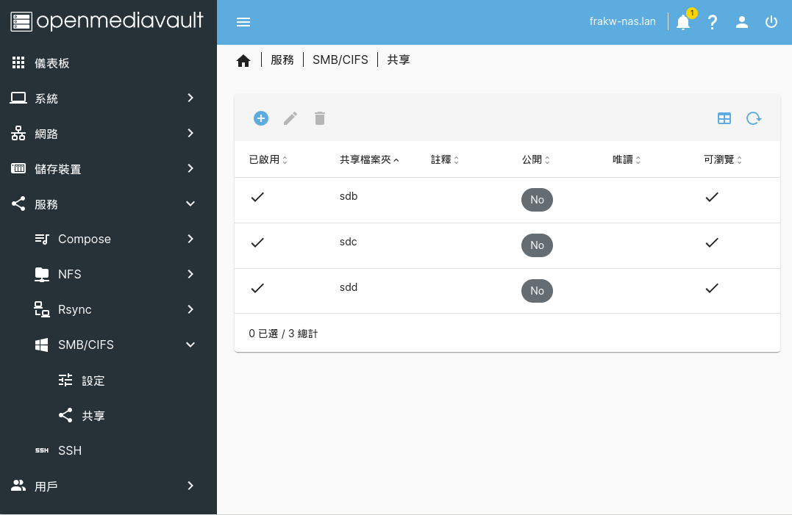
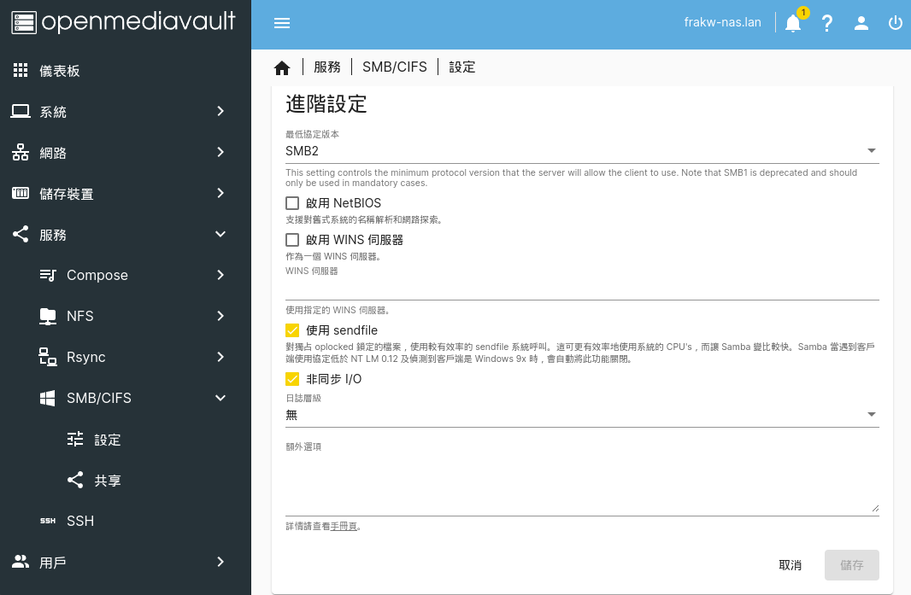
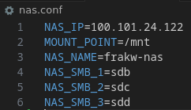
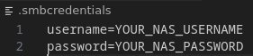
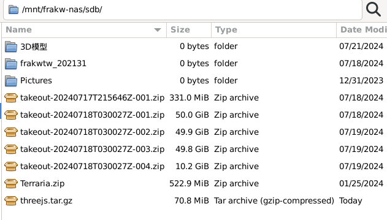
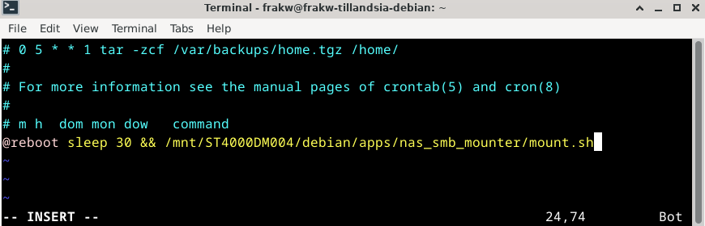

# nas_smb_mounter
Scripts for mount nas smb folder in linux system.
[中文版](README_zh-tw.md)

# Automatically Mount NAS SMB Folders at Boot on Linux
This tutorial is based on Debian systems.
The NAS is using OpenMediaVault.

## NAS Setup
\
\
There are three SMB folders on the NAS:
* sdb
* sdc
* sdd

## Configure NAS SMB Folders
```console
git clone https://github.com/frakw/nas_smb_mounter.git
```
Edit `nas.conf` to store the basic information of the NAS:
```
NAS_IP=NAS_IP_address
MOUNT_POINT=/mnt
NAS_NAME=NAS_name
NAS_SMB_1=Name_of_the_first_NAS_SMB_folder
NAS_SMB_2=Name_of_the_second_NAS_SMB_folder
NAS_SMB_3=Name_of_the_third_NAS_SMB_folder
```
\
Edit `.smbcredentials` to store the NAS account credentials:
```
username=NAS_username
password=NAS_password
```

## Test the Mounting Process
```console
cd nas_smb_mounter
```
Set the permissions for `.smbcredentials`:
```console
sudo chmod 600 .smbcredentials
```
Install necessary packages:
```console
sudo apt install cifs-utils
```
Make the scripts executable:
```console
sudo chmod +x mount.sh
sudo chmod +x unmount.sh
```
Run the mounting script:
```console
./mount.sh
```
Successfully view the folder contents:
\
Unmount the folders:
```console
./unmount.sh
```
## Automatically Mount at Boot
```
sudo crontab -e
```
Add the following line at the bottom:
```console
@reboot sleep 30 && /path/to/mount.sh
```
\
The `sleep 30` is added because I connect to the NAS via Tailscale, so it waits for Tailscale to start before executing the script.