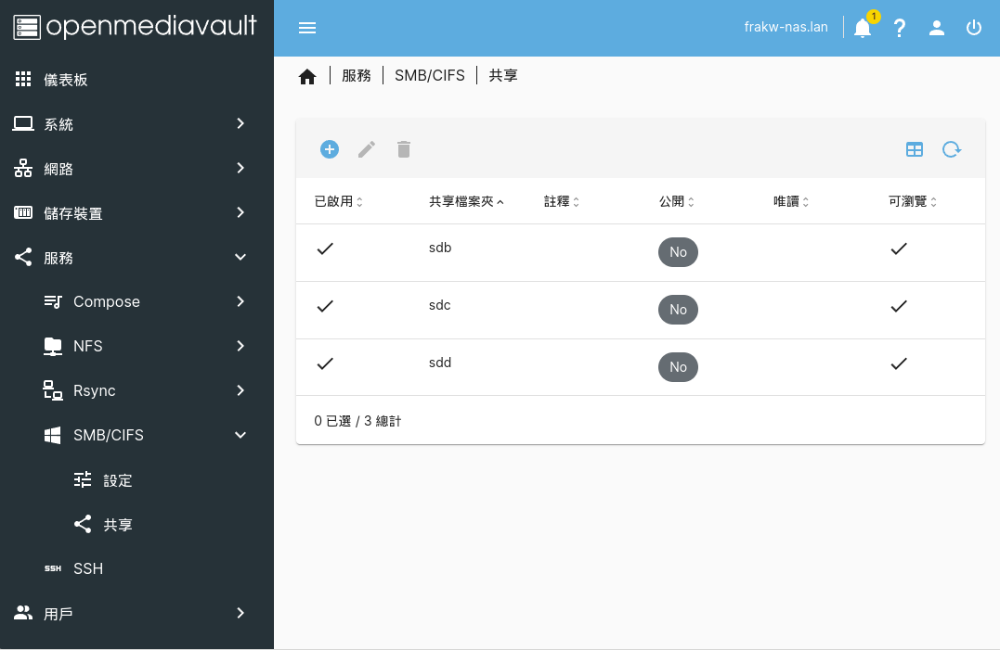

# nas_smb_mounter
Linux系統中掛載nas smb資料夾的腳本
[English Version](README.md)

# Linux 開機自動掛載NAS的SMB資料夾
本教學以debian系統為主
NAS使用OpenMediaVault
## NAS設置
\
\
共有三個smb資料夾，︁分別是
* sdb
* sdc
* sdd
## 設定NAS SMB資料夾
```sh
git clone https://github.com/frakw/nas_smb_mounter.git
```
修改`nas.conf`，︁存放NAS的基本資訊
```conf
NAS_IP=NAS的IP
MOUNT_POINT=/mnt
NAS_NAME=NAS的名字
NAS_SMB_1=NAS的第1個SMB資料夾名稱
NAS_SMB_2=NAS的第2個SMB資料夾名稱
NAS_SMB_3=NAS的第3個SMB資料夾名稱
```
\
修改`.smbcredentials`，︁存放NAS的帳號密碼
```conf
username=NAS的使用者名稱
password=NAS的使用者密碼
```
\
## 測試掛載
```sh
cd nas_smb_mounter
```
設定`.smbcredentials`的權限
```sh
sudo chmod 600 .smbcredentials
```
安裝必要套件
```sh
sudo apt install cifs-utils 
```
設定腳本為可執行文件
```sh
sudo chmod +x mount.sh
sudo chmod +x unmount.sh
```
執行掛載
```sh
./mount.sh
```
成功看到資料夾內容
\
解除掛載
```sh
./unmount.sh
```
## 開機自動進行掛載
```sh
sudo crontab -e
```
在最底下加入
```
@reboot sleep 30 && <mount.sh的位置>
```
\
會加入`sleep 30`是因為我透過Tailscale來與NAS連線，︁所以等待Tailscale啟動後再執行